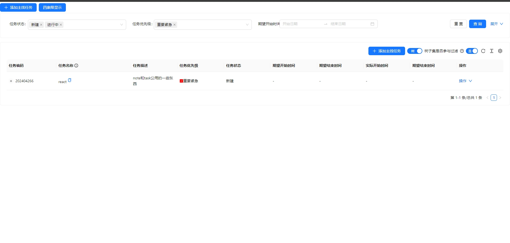
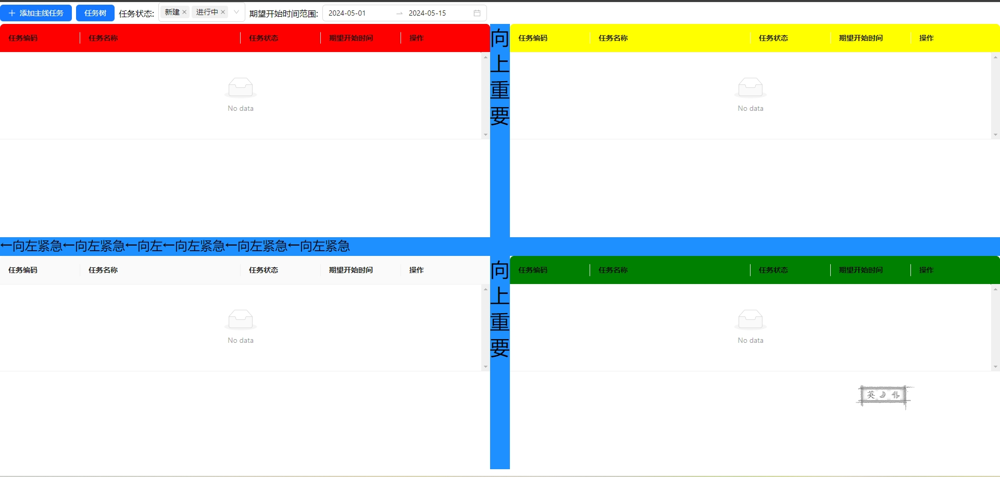
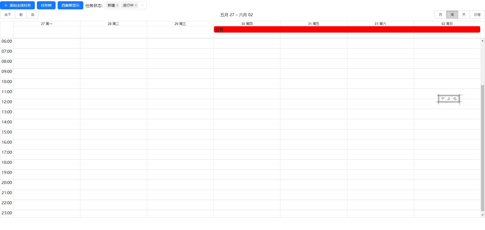
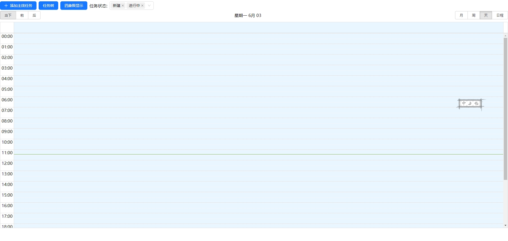
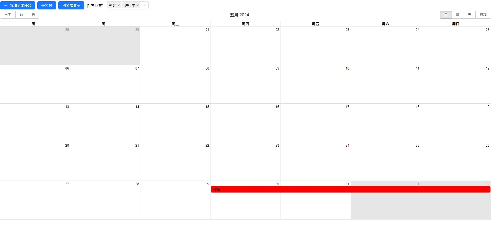

# 任务管理小应用
平时事情不多但是容易忘记，最近也在学习react，便开发了这个应用。

应用将任务分为三种类型来管理：任务树、[四象线](https://baike.baidu.com/item/%E5%9B%9B%E8%B1%A1%E9%99%90%E6%B3%95/4228184?fr=ge_ala)和日历任务管理
## 任务树
1. 层级展示任务
2. 可在操作中四象线展示子任务


## 四象线
1. 向上重要
2. 向左紧急


## 日历
1. 月，周，日展示
2. 只有期望开始时间和期望结束时间都填写的时候才会在日历中展示



## 项目启动
### 后端服务启动
1. 后端启动应用需求：docker，redis，mysql8。
2. jar通过docker打入镜像中，无需java环境。
3. 使用docker/Dockerfile-server文件构建镜像及运行容器
4. 通过docker/hosts修改自己数据库ip和redis的ip
5. 数据库端口：3306,数据库名：task_manager，数据库用户名及密码：task_manager_user/TaskMU0001，redis：无密码认证。（此条内容目前代码写死，后期修改为可配置）
构建镜像
```shell
docker build -t task-manager-server -f Dockerfile-server .
```
运行
```shell
docker run -d -p 8090:8090 --restart unless-stopped -v ./hosts:/etc/hosts --name task-manager-server task-manager-server
```
### 前端项目启动
1. 前端启动应用需求：docker
2. 需要在电脑hosts（linux地址/etc/hosts,windows地址C:\Windows\System32\drivers\etc\hosts）中配置后端运行环境地址，例如添加：127.0.0.1       taskmanagerserver.com
   构建镜像
```shell
docker build -t task-manager-nginx .
```
运行
```shell
docker run -d -p 3001:3001 --restart unless-stopped --name task-manager-nginx task-manager-nginx
```
## 查看页面
http://taskmanagerserver.com:3001
